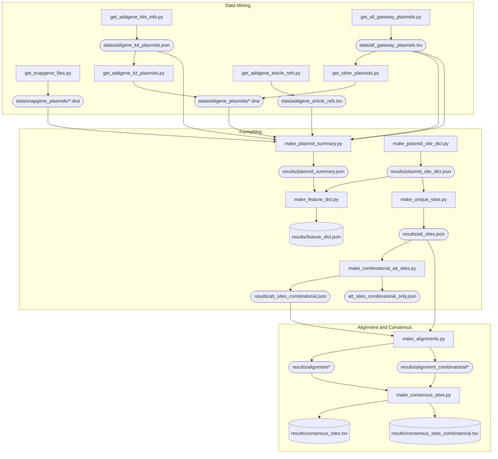

# Gateway Sequence Sites

This repository contains the code and data for extracting Gateway sequence sites from AddGene and SnapGene plasmids, and:

* Extract consensus sequences from the Gateway sites.
* Create a web application to visualize the Gateway plasmids. Can be accessed at https://gatewaymine.netlify.app/.


The SnapGene plasmid collection files can be found inside the SnapGene installation folder, in Mac the path is `/Applications/SnapGene.app/Contents/Resources/Plasmids`. To access it go to `Applications`, then right click SnapGene and select "Show Package Contents".




Instructions to run this locally are below, first the analysis is described.

## Analysis

### Extracting Gateway sequence sites

First, with the `format_snapgene_plasmids.py` script, we go through the SnapGene Gateway plasmid collection and extract the Gateway sequence sites, which are stored in the `attP.fa` and `attR.fa` files.

There are several versions of each attP site, and I have named them attPx_y, where x is the attP site and y is the version. The versions are ordered by how many times they appear in the SnapGene plasmid collection, so the most common version is attPx_1, then attPx_2, etc.

The script also creates a `plasmid2sites.tsv` file, which contains the mapping between the plasmid names and the Gateway sequence sites.

### Manually clone plasmids

To understand how SnapGene designs primers for Gateway BP cloning, I manually cloned several plasmids with all the possible attP sites from the SnapGene plasmid collection. For each case, I designed primers with SnapGene's primer design for BP cloning, to clone the CDS of ase1 (S. pombe gene -see `manual_cloning/CU329670.gb`-) into an entry vector.

The files containing the entry vectors as well as the PCR products used to generate them can be found in the `manual_cloning` folder. They are named according to the attP sites present in the plasmid from the SnapGene plasmid collection that was used to generate them.

### Extracting Gateway sequence sites from manually cloned plasmids

With the `format_manual_cloning.py` script, we extract the Gateway sequence sites from the manually cloned plasmids in a similar way to the SnapGene plasmid collection, the results are stored in the `attB_manual.fa` and `attL_manual.fa` files, which come from the PCR products and entry vectors respectively.

### Aligning Gateway sequence sites

With the `make_alignments.py` script, we align the Gateway sequence sites extracted from the SnapGene plasmid collection and the manually cloned plasmids, grouped in different ways. All the results are stored in the `alignments` folder.

The most interesting ones are in `all_sorted.clu`, which contains all the Gateway sequence sites sorted by attP site and version, and `groupx.clu`, which contains the Gateway sequence sites grouped by attP site.

## Conclusion

From the below bit of the alignment, it seems that the part marked with `x` is common in each group (across the attP, attB, attL and attR), so that should be the part used for recombination when simulating the reactions.

For example, for a BP reaction, the algorithm should find attP and attB sites of the same type (e.g. attP1 and attB1), and use the part marked with `x` for recombination.

```

                                1  TGTACAAAAAAG
                                2  TGTACAAGAAAG
                                3  TGTATAATAAAG
                                4  TGTATAGAAAAG
                                5  TGTATACAAAAG
                                   xxxxxxxxxxxx
                             * * * **** *  ****  *
attB1_1      ---------------ACAAGTTTGTACAAAAAAGCAGGCT--------------------
attB1_2      ---------------ACAAGTTTGTACAAAAAAGCAGGCT--------------------
attB1_3      ---------------ACAAGTTTGTACAAAAAAGCAGGCT--------------------
attB1_4      ---------------ACAAGTTTGTACAAAAAAGCAGTCC--------------------
attL1_1      TGCTTTTTTATAATGCCAACTTTGTACAAAAAAGCAGGCT--------------------
attL1_2      TGCTTTTTTATAATGCCAAGTTTGTACAAAAAAGCAGGCT--------------------
attL1_3      TGCTTTTTTATAATGCCAACTTTGTACAAAAAAGCAGGCT--------------------
attP1_1      TGCTTTTTTATAATGCCAACTTTGTACAAAAAAGCTGAACGAGAAACGTAAAATGATATA
attP1_2      TGCTTTTTTATAATGCCAAGTTTGTACAAAAAAGCAGAACGAGAAACGTAAAATGATATA
attP1_3      TGCTTTTTTATAATGCCAACTTTGTACAAAAAAGCTGAACGAGAAACGTAAAATGATATA
attP1_4      TGCTTTTTTATAATGCCAACTTTGTACAAAAAAGTTGAACGAGAAACGTAAAATGATATA
attR1        ---------------ACAAGTTTGTACAAAAAAGCTGAACGAGAAACGTAAAATGATATA
attB2_1      ---------------ACCACTTTGTACAAGAAAGCTGGGT--------------------
attB2_2      ---------------ACCACTTTGTACAAGAAAGCTGGGT--------------------
attB2_3      ---------------ACCACTTTGTACAAGAAAGCTGTCC--------------------
attL2_1      TGCTTTCTTATAATGCCAACTTTGTACAAGAAAGCTGGGT--------------------
attL2_2      TGCTTTCTTATAATGCCCACTTTGTACAAGAAAGCTGGGT--------------------
attP2_1      TGCTTTCTTATAATGCCAACTTTGTACAAGAAAGCTGAACGAGAAACGTAAAATGATATA
attP2_2      TGCTTTCTTATAATGCCCACTTTGTACAAGAAAGCTGAACGAGAAACGTAAAATGATATA
attP2_3      TGCTTTTTTATAATGCCAACTTTGTACAAGAAAGTTGAACGAGAAACGTAAAATGATATA
attR2        ---------------ACCACTTTGTACAAGAAAGCTGAACGAGAAACGTAAAATGATATA
attB3_1      ----------------CAACTTTGTATAATAAAGTTG-----------------------
attB3_2      ----------------CAACTTTGTATAATAAAGTTG-----------------------
attL3_1      TGCTTTTTTATAATGCCAACTTTGTATAATAAAGTTG-----------------------
attL3_2      TGCTTTTTTATAATGCCAACTTTGTATAATAAAGTTG-----------------------
attP3_1      TGCTTTTTTATAATGCCAACTTTGTATAATAAAGTTGAACGAGAAACGTAAAATGATATA
attP3_2      TGCTTTTTTATAATGCCAACTTTGTATAATAAAGTTGAACGAGAAACGTAAAATGATATA
attR3        ----------------CAACTATGTATAATAAAGTTGAACGAGAAACGTAAAATGATATA
attB4_1      ----------------CAACTTTGTATAGAAAAGTTG-----------------------
attB4_2      ----------------CAACTTTGTATAGAAAAGTTG-----------------------
attL4_1      TGCTTTCTTATAATGCCAACTTTGTATAGAAAAGTTG-----------------------
attL4_2      TGCTTTTTTATAATGCCAACTTTGTATAGAAAAGTTG-----------------------
attP4_1      TGCTTTCTTATAATGCCAACTTTGTATAGAAAAGTTGAACGAGAAACGTAAAATGATATA
attP4_2      TGCTTTTTTATAATGCCAACTTTGTATAGAAAAGTTGAACGAGAAACGTAAAATGATATA
attR4_1      ---------------TCAACTTTGTATAGAAAAGTTGAACGAGAAACGTAAAATGATATA
attR4_2      ----------------CAACTTTGTATAGAAAAGTTGAACGAGAAACGTAAAATGATATA
attB5        ----------------CAACTTTGTATACAAAAGTTG-----------------------
attL5        TGCTTTTTTATAATGCCAACTTTGTATACAAAAGTTG-----------------------
attP5        TGCTTTTTTATAATGCCAACTTTGTATACAAAAGTTGAACGAGAAACGTAAAATGATATA
                             * * * **** *  ****  *                       
```

### What constitutes a Gateway site?

In the files received from Valerie, some Gateway sites are identical to those in the SnapGene collection (see the files in `manual_cloning/example_valerie` that contain `annotated` in the name). However, not all of them contain "canonical" Gateway sites. For example, the file `483_P4-P1r_EC1.2EC1.1p` contains a canonical `attL4_2` site identical to the SnapGene ones, and from its name it should contain an attL1 site as well. By looking for the `attL1` overlap sequence `TGTACAAAAAAG` in the sequence, I can find it in the "right place" (flanking the promoter, opposite to the `attL4_2` site). However, the site does not look like the other attL1 sites from SnapGene:

> The below alignment was done with `./clustalo -i alignments/valerie.fa --force --outfmt=clu -o alignments/valerie.clu`. `valerie.fa` contains the `attL1` sites extracted from the manually cloned plasmids + the `attL1_483` site extracted from `483_P4-P1r_EC1.2EC1.1p` as the surrounding sequence to `TGTACAAAAAAG`.

```
attL1_483      actctctaaagttaacacacaattctcatcacaaacaaatcaaccaaagcaacttctact
attL1_1        -------CAAA-----TAATGATTTTATTTTGA---------CTGATAGTGACCTGTTCG
attL1_2        -------CAAA-----TAATGATTTTATTTTGA---------CTGATAGTGACCTGTTCG
attL1_3        -------CAAA-----TAATGATTTTATTTTGA---------CTGATAGTGACCTGTTCG
                       **        *  *** *  *   *            * **  ** * * * 

attL1_483      ctt--tcttctttcgaccttatcaatctgttgagaaacaagttTGTACAAAAAAGttgaa
attL1_1        TTGCAACAAATTGATGAGCAATGCTTTTTTATAATGCCAACTTTGTACAAAAAAGCAGGC
attL1_2        TTGCAACAAATTGATGAGCAATGCTTTTTTATAATGCCAAGTTTGTACAAAAAAGCAGGC
attL1_3        TTGCAACACATTGATGAGCAATGCTTTTTTATAATGCCAACTTTGTACAAAAAAGCAGGC
                *    *   **        **   * * *  *    *** **************  *  

attL1_483      cgagaaacgtaaaatgatataaa
attL1_1        T----------------------
attL1_2        T----------------------
attL1_3        T----------------------

```

What could be done in this case? I guess you could just recombine using the overlap sequence only (`TGTACAAAAAAG`) and ignore the flanking rest. However, I imagine the surrounding sequence is important for the recombination to work.

### Dependencies

#### With pip

```bash
python -m venv .venv
source .venv/bin/activate
pip install biopython
pip install pydna
```

#### With poetry

```bash
poetry install
poetry shell # Activate the virtual environment
```

#### Clustalo

Running the `make_alignments.py` script requires `clustalo`. You can download it as a binary from [here](http://www.clustal.org/omega/), and rename it to `clustalo`.

### Running the scripts

```bash
python format_snapgene_plasmids.py --folder <path/to/plasmids>
python format_manual_cloning.py
python make_alignments.py
```

## Contributing

This could be extended to support other plasmid sources, but for now it only supports the SnapGene plasmid collection. Feel free to submit a PR.


If using playwright for the first time, you may have to run "playwright install"