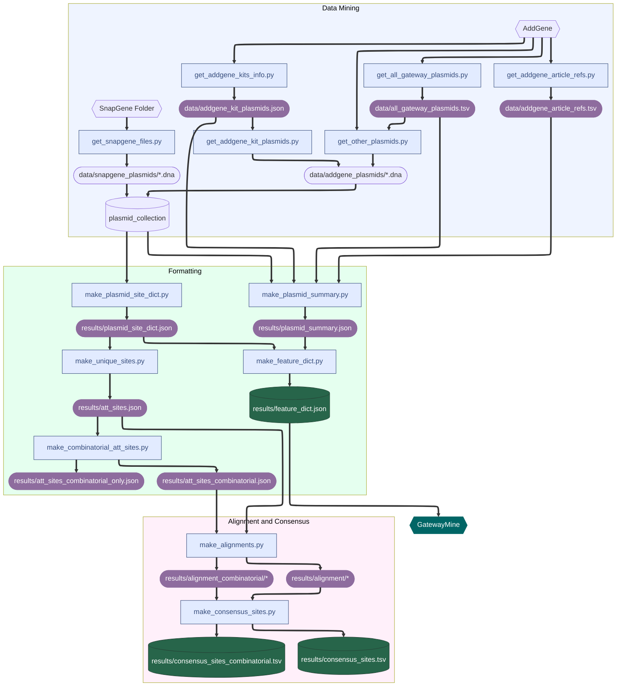

# GateWayMine 🚀

This repository contains the code and data for extracting Gateway sequence sites from AddGene and SnapGene plasmids, and use them to:

* Extract consensus sequences from the Gateway sites.
* Create a web application to visualize the Gateway plasmids. Can be accessed at https://gatewaymine.netlify.app/.

## Summary of the analysis 📊


### Data mining ⛏️

The scripts in this repository were used to download plasmids from AddGene and copying the Gateway plasmis from the SnapGene collection (present in the SnapGene installation folder) to create a collection of Gateway plasmids (attached as a release artifact).

Additional information about AddGene plasmids was also mined, such as whether they are part of kits, and related publication links.

### Formatting 🔄

The plasmids files were read, and if their annotation contained Gateway sequence sites (identied by a label `attXn`, where X is the att site and n is the version), the sequence of those sites was extracted. The file [results/plasmid_site_dict.json](results/plasmid_site_dict.json) contains a dictionary of all the plasmids in the collection, with the Gateway sequence sites they contain.

This file was then used to generate a collection of all version of each Gateway sequence site (e.g. all the versions of `attP1`, `attB1`, etc.). Contained in the file [results/att_sites.json](results/att_sites.json). Because sites can be recombined with each other (e.g. `attP1 + attB1 -> attL1`), the sites found in plasmids were recombined in all possible combinations, to yield an even larger collection of sites. This is contained in the file [results/att_sites_combinatorial.json](results/att_sites_combinatorial.json). These two files were used for alignment in the next step.

In addition, the mined plasmid information was used to create a summary dataset, contained in the file [results/plasmid_features.json](results/plasmid_features.json). This file contains a dictionary of all the plasmids in the collection, listing:
* Their name
* The Gateway sequence sites they contain
* The sequence features they contain
* Whether they were extracted from SnapGene or AddGene
* If they are from AddGene:
  * Their AddGene ID
  * Kit to which they belong (if any)
  * Publication links (if any)

This dataset was made queryable as a [web application](https://gatewaymine.netlify.app/), of which the source code is in the `web_app` folder.

### Alignment and consensus 🧬

To generate the consensus sequences, the Gateway sequence sites were aligned using [Clustal Omega](http://www.clustal.org/omega/). The alignment files are contained in the `alignments` folder (generated only with the sites found in plasmids) and `alignments_combinatorial` (using also the combinatorial sites).

From an alignment, consensus sequences were generated by removing flaking positions containing either spacers and/or all `ACGT` nucleotides, and then using ambiguous nucleotides to represent the consensus, for example the below dummy example:

```
seq1      TGCTAATA
seq2      -GCTCCTT
seq3      TGCTCCCG
seq4      TGCTGACC

consensus  GCTVMY
```

The consensus sequences are contained in the files [results/consensus_sites.tsv](results/consensus_sites.tsv) and [results/consensus_sites_combinatorial.tsv](results/consensus_sites_combinatorial.tsv), which were created with only the sites found in plasmids and those plus the combinatorial sites respectively.

In addition, even more permissive consensus sequences were generated. What gives specificity for recombination of a pair of sites
is the overlap sequence conserved in all `attB`, `P`, `L` and `R` sites with the same number (e.g. all attX1 sites contain `twtGTACAAAaaa` as the overlap sequence). An aligment of all sites of a given type (e.g. all attB sites), excluding the overlap sequence was used to generate more permissive consensus sequences. Those consensus sequences are in the mentioned files, but with `merged_` prefixed to the site name.

## Running the analysis locally 💻

### Dependencies 📦

The analysis is run using python, using [poetry](https://python-poetry.org/) to manage dependencies.

```bash
# Install dependencies
poetry install

# Activate virtual environment
poetry shell
```

`clustalo` is used for alignment, and can be downloaded as a binary from [here](http://www.clustal.org/omega/). Once downloaded, rename it to `clustalo` and place it in the root folder of the repository. If you want to provide an alternative path, you can do so with script arguments (see script docs).

### Pipeline ⚙️

The pipeline is described in the following diagram:



#### Data mining ⛏️

To run locally, first download the plasmid collection from the lastest release of this repository, and place the folders `addgene_plasmids` and `snapgene_plasmids` in the `data` folder.

If you want to re-download the plasmids (reproduce the data mining). You can do so with the bash script `run_data_mining.sh`, see the documentation of called scripts.

`playwright` is used for scraping. If used for the first time, you will be prompted to run `playwright install`

#### Formatting 🔄

See the documentation of scripts called in `run_formatting.sh`.

#### Alignment and consensus 🧬

See the documentation of scripts called in `run_alignments_and_consensus.sh`.

## Web application 🌐

The web application is a simple [React](https://react.dev/) application built with [Vite](https://vitejs.dev/). It was generated with `yarn create vite` (see [docs](https://vite.dev/guide/)), so the `yarn` package manager is required. The directory structure is standard, and documented in the vite docs.

```bash
# Enable yarn 3
corepack enable

# Install dependencies
yarn install

# Run dev server
yarn dev

# Build for production
yarn build
```

The only extra configuration is copying the `plasmid_features.json` file to the `public` folder when building or serving locally, so it can be requested by the frontend application, see the config at [web_app/vite.config.js](web_app/vite.config.js).


## Contributing 🤝

### Adding new AddGene plasmids 🔬

> **NOTE:** Make sure the plasmid is not already there!

To add new plasmids from AddGene, add a row to the file [all_gateway_plasmids.tsv](data/all_gateway_plasmids.tsv), with the following columns:

* `plasmid_id`: The plasmid ID from AddGene
* `plasmid_name`: The name of the plasmid
* `reference`: (optional) The reference article id for the plasmid (this is the number at the end of the URL in the AddGene page). For the example below the publication links to https://www.addgene.org/browse/article/7274/, so the reference is `7274`.

  

Once you have done this:

```bash
# Get publication links (if not already present)
python get_addgene_article_refs.py

# Download the new plasmid
python get_other_plasmids.py

# Run the formatting pipeline
bash run_formatting.sh

# Run the alignment and consensus pipeline
bash run_alignments_and_consensus.sh

# Re-build the web app
```

### Other sources of plasmids ✨

This could be extended to support other plasmid sources, but for now it only supports the SnapGene and AddGene plasmid collections. Feel free to submit an issue to discuss it!


